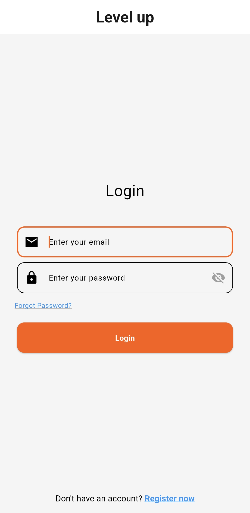
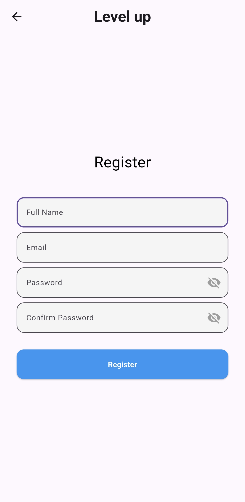
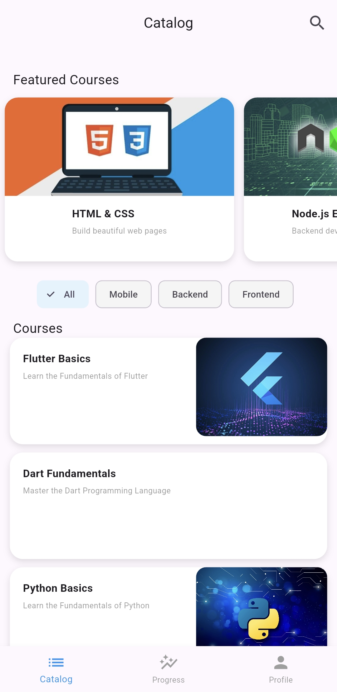
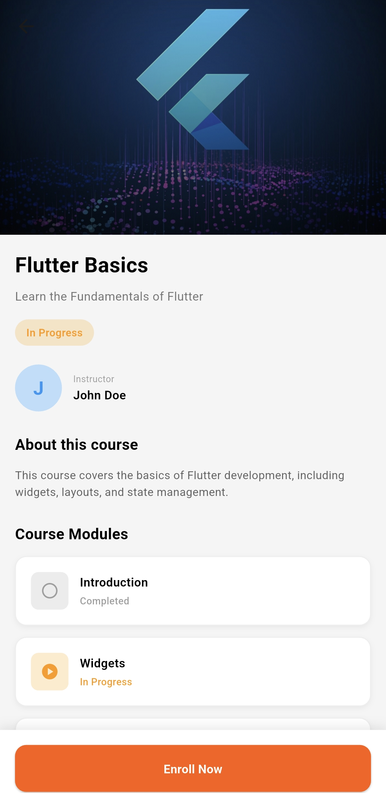
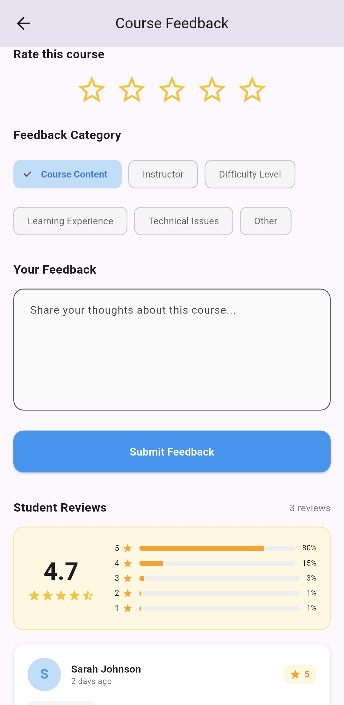
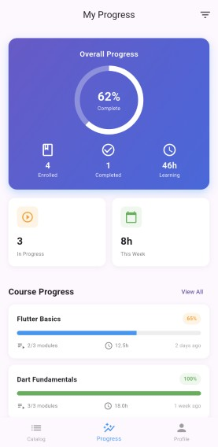
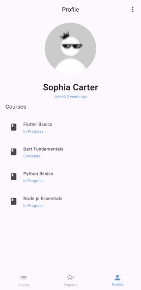

# Level-up Learning App

# Level-up Learning App

 

## Table of Contents
- [Project Overview](#project-overview)
- [Problem Statement](#problem-statement)
- [Proposed Features](#proposed-features)
- [App Screens](#app-screens)
- [Tech Stack](#tech-stack)
- [App Architecture](#app-architecture)
- [Project Structure](#project-structure)
- [Dependencies](#dependencies)
- [Getting Started](#getting-started)
- [Usage](#usage)
- [Contributors](#contributors)
- [License](#license)
- [Acknowledgments](#acknowledgments)

## Project Overview

**Project Name**: Level-up  
**Objective**: Develop a user-friendly mobile application using Flutter to empower users to learn new courses and life skills, with interactive features for course exploration, progress tracking, and personalized reports.  
**Target Audience**: Beginners, hobbyists, and lifelong learners seeking accessible skill development.  
**Purpose**: Provide an engaging, scalable platform for skill acquisition, designed specifically for Flutter beginners to implement core app development concepts.  
**Platform**: Cross-platform mobile app (iOS and Android) built with Flutter and Dart, leveraging Firebase for backend services.

## Problem Statement

Many individuals lack access to an intuitive, centralized platform for learning diverse skills, from academic courses to practical life skills (e.g., cooking, coding, or time management). Existing apps often overwhelm beginners with complex interfaces or lack personalized progress tracking. Level-up aims to address this by offering a beginner-friendly, interactive learning experience with a clean UI and seamless functionality, built using Flutter for hands-on learning.

## Proposed Features

The Level-up app will include the following core features, designed to align with Flutter beginner capabilities:

- **User Authentication**: Allows users to register and login to access personalized features.
- **Course/Skill Catalog**: Display a catalog of available courses and life skills for users to browse.
- **Course/Skill Detail Page**: Provide a detailed view for each course or skill including description, duration, and prerequisites.
- **User Profile & Progress Tracking**: Enable users to view their learning progress and enrolled courses.
  
## App Screens

| Screen | Preview |
|--------|---------|
| **Login** |  |
| **Register** |  |
| **Catalog** |  |
| **Course Detail** |  |
| **Feedback** |  |
| **Progress** |  |
| **Profile** |  |

## Tech Stack

- **Frontend**: Flutter (Dart)
- **Backend**: Firebase (Authentication, Firestore for data storage)
- **Other Tools**: Git for version control, potentially packages like `firebase_auth`, `cloud_firestore`, etc.

  ## App Architecture

The app follows a **clean and modular architecture**:

- **UI Layer:** Flutter Widgets for responsive design.  
- **State Management:** Provider for reactive state updates.  
- **Data Layer:** Firebase Firestore for user, course, and progress data.  
- **Authentication:** Firebase Auth for login and registration.  
- **Service Layer:** Separate services for Firestore and Authentication logic.  

## Project Structure
lib/                                                                                                                       
├── theme/                                                                                                    
│ └── app_theme.dart                                                                                             
├── models/                                                                                                                  
| ├── course_model.dart                                                                                                   
| └── user_model.dart                                                                                                          
├── pages/                                                                                                          
│ ├── CourseDetailPage.dart                                                                                     
│ ├── bottom_nav.dart                                                                                             
│ ├── catalog_page.dart                                                                                            
│ ├── feedback_page.dart                                                                                            
│ ├── login.dart                                                                                                   
│ ├── profile_page.dart                                                                                              
│ ├── progress_page.dart                                                                                            
│ ├── register.dart                                                                                                 
│ └── splash_screen.dart                                                                                                  
├── services/                                                                                                        
| ├── auth_service.dart                                                                                                         
| └── firestore_service.dart                                                                                                  
├── widgets/                                                                                                       
│ ├── course_card.dart                                                                                               
│ ├── elevated_btn.dart                                                                                            
│ └── input_field.dart                                                                                                  
├── main.dart                                                                                                                                          

## Dependencies

The app uses the following Flutter and Firebase packages:

- **firebase_core** – Initializes Firebase in the app.  
- **firebase_auth** – Handles user authentication (login, signup).  
- **cloud_firestore** – Stores user data, courses, and progress.  
- **firebase_storage** – For uploading and retrieving media files.  
- **provider** – Simple state management solution.  
- **google_fonts** – Provides clean and modern typography.  
- **fluttertoast** – Displays feedback and toast notifications.  

To install all dependencies, run:
bash command :- flutter pub get

## Getting Started

### Prerequisites

- Flutter SDK installed (version 3.0+ recommended)
- Dart SDK (comes with Flutter)
- Android Studio or Xcode for emulators/simulators
- Firebase account for backend setup

### Installation

1. Clone the repository:
git clone https://github.com/Manishshtestha/excelerate_intern_app.git
cd excelerate_intern_app

2. Install dependencies:
flutter pub get

3. Set up Firebase:
- Create a Firebase project at [console.firebase.google.com](https://console.firebase.google.com).
- Add Android and iOS apps to your Firebase project.
- Download `google-services.json` (Android) and `GoogleService-Info.plist` (iOS) and place them in the respective directories (`android/app/` and `ios/Runner/`).
- Enable Authentication and Firestore in Firebase console.

4. Run the app:
flutter run

## Usage

- **Sign Up/Login**: Create an account to start exploring skills.
- **Browse Catalog**: View available courses and life skills.
- **Enroll in Courses**: Dive into details and track your progress via the profile.

For more details on the user journey, refer to the [User Journey Guide](docs/user-journey.md) (if available).

## Contributors

- [Abhay Shaw](https://github.com/abhayshaw323)
- [Atif Shaif](https://github.com/atifs899)
- [Lungile Mawila](https://github.com/LungstarCode)
- [Manish Shrestha](https://github.com/ManishShtestha)
- [Ofentse Mathosi](https://github.com/Ofentsefefe) 
- [Tanzila Ahmmed Shoronika](https://github.com/shoronika)

## License

This project is licensed under the MIT License - see the [LICENSE](LICENSE) file for details.

## Acknowledgments

- Inspired by experiential learning platforms like Excelerate.
- Built as part of an internship project for beginner Flutter developers.

For any questions or feedback, open an issue or contact the maintainers! 🚀
